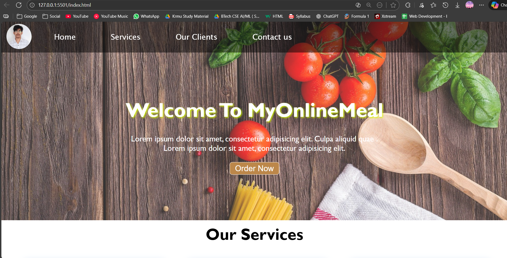

# food_delivery_Website_made_by_Moin_Khan
Food Delivery Website – Moin Khan

This project is a web development capstone assignment designed to simulate a Food Delivery Service landing page. It utilizes HTML and CSS to create a responsive and visually appealing user interface.

📌 Project Overview

The goal of this project is to build a static website for a food delivery service. It focuses on layout design, styling, and responsiveness, ensuring the site looks good on both desktop and mobile devices.

📸 Expected Output

📂 Project Structure

CAPSTON-PROJECT/
├── img/                   # Image assets (logos, food items, brand icons)
│   ├── apple.png
│   ├── delevary.png
│   ├── hp.png
│   ├── microsoft.png
│   ├── skype.png
│   └── ...
├── .gitignore             # Git ignore file
├── index.html             # Main HTML structure
├── styles.css             # Main stylesheet for desktop view
├── phone.css              # Media queries for mobile responsiveness
├── new.css                # Additional styling
├── output.png             # Screenshot of the final website
└── README.md              # Project documentation

🛠️ Technologies Used

HTML5: For structuring the web page content.

CSS3: For styling, including:

Flexbox/Grid: For layout management.

Media Queries: To handle responsiveness (via phone.css).

External CSS: Separated concerns using styles.css and new.css.

🚀 Getting Started

To view this project on your local machine:

Clone the repository:

git clone [https://github.com/Khanmoin4947/KRMU_Web-Dev.git](https://github.com/Khanmoin4947/KRMU_Web-Dev.git)

Navigate to the project folder:

cd KRMU_Web-Dev/Capston-project

Run the website:

Simply double-click the index.html file to open it in your default web browser.

OR, if you are using VS Code, use the Live Server extension to launch it.

👤 Author

Moin Khan

Course: Web Development

GitHub: Khanmoin4947

# Expected output

